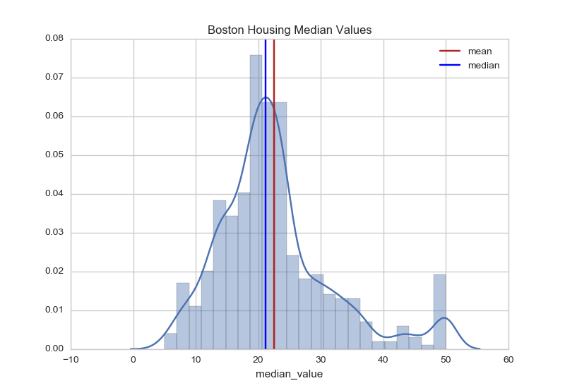
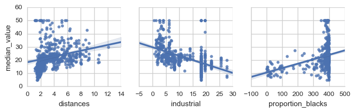
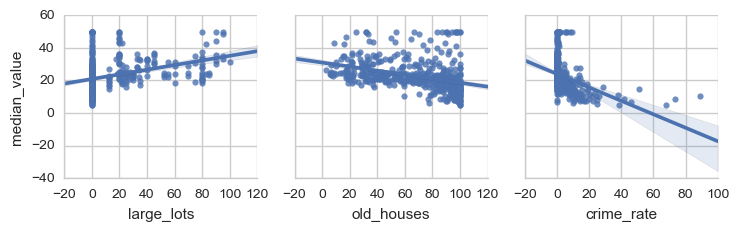
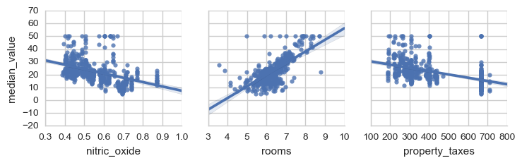

Statistical Analysis and Data Exploration
=========================================

The Data
--------

The data was taken from the `sklearn.load_boston <http://scikit-learn.org/stable/modules/generated/sklearn.datasets.load_boston.html>`_ function, which itself cites the `UCI Machine Learning Repository <http://archive.ics.uci.edu/ml/datasets/Housing>`_ as their source for the data. The data gives values for various features of different suburbs of Boston as well as the median-value for homes in the suburbs. The features were chosen to reflect various aspects believed to influence the price of houses including the structure of the house (age and spaciousness), the quality of the neighborhood, transportation access to employment centers and highways, and pollution.

Here is the description of the data variables provided by sklearn.

.. csv-table:: Attribute Information (in order)
   :header: Variable Name, Description
   :delim: :
         
   CRIM     :per capita crime rate by town
   ZN       :proportion of residential land zoned for lots over 25,000 sq.ft.
   INDUS    :proportion of non-retail business acres per town
   CHAS     :Charles River dummy variable (= 1 if tract bounds river; 0 otherwise)
   NOX      :nitric oxides concentration (parts per 10 million)
   RM       :average number of rooms per dwelling
   AGE      :proportion of owner-occupied units built prior to 1940
   DIS      :weighted distances to five Boston employment centres
   RAD      :index of accessibility to radial highways
   TAX      :full-value property-tax rate per $10,000
   PTRATIO  :pupil-teacher ratio by town
   B        :1000(Bk - 0.63)^2 where Bk is the proportion of blacks by town
   LSTAT    :% lower status of the population
   MEDV     :Median value of owner-occupied homes in $1000's

.. note:: The data comes from the 1970 U.S. Census so its values don't (necessarily) reflect current values.

Cleaning the Data
-----------------

Since there are no missing data points, there isn't much to do to clean the data, but the odd variable names increase the likelihood of error so I'm going to expand them to full variable names.

.. csv-table:: Variable Aliases
   :header: Original Variable, New Variable

   CRIM,crime_rate
   ZN,large_lots
   INDUS,industrial
   CHAS,charles_river
   NOX,nitric_oxide
   RM,rooms
   AGE,old_houses
   DIS,distances
   RAD,highway_access
   TAX,property_taxes
   PTRATIO,pupil_teacher_ratio
   B,proportion_blacks
   LSTAT,lower_status

Summary Statistics
------------------

.. csv-table:: Boston Housing dataset statistics (in $1000's)
   :header: Item, Value

   Total number of instances,506
   Total number of features,13.0
   Minimum house price,5.0
   Maximum house price,50.0
   Mean house price,22.53
   Median house price,21.2
   Sample Standard deviation of house price,9.19

.. '

Plots
-----

.. image:: figures/median_value_boxplots.png

.. <<name='violinplot', results='sphinx', echo=False, include=False>>=
.. filename = 'figures/median_value_violinplot.png'
.. figure = plot.figure()
.. axe = figure.gca()
.. grid = seaborn.violinplot(housing_data.median_value, ax=axe)
.. title = axe.set_title("Boston Housing Median Values")
.. figure.savefig(filename)
.. print(".. image:: {0}".format(filename))
.. @

.. image:: figures/median_value_qqplot.png

.. image:: figures/median_value_cdf.png

Looking at the distribution (histogram and KDE plot) and box-plot the median-values for the homes appear to be right-skewed. The CDF shows that about 90% of the homes are $35,000 or less (the 90th percentile for median-value is 34.8). The qq-plot and the other plots show that the median-values aren't normally distributed.

.. '

Question 1
----------

*Of the features available for each data point, choose three that you feel are significant and give a brief description for each of what they measure.*

To get an idea of how the features are related to the median-value, I'll plot some linear-regressions.

.. '

.. image:: figures/housing_data_regression_plots_3.png

|

.. image:: figures/housing_data_regression_plots_5.png

Looking at the plots, the three features that I think are the most significant are `lower_status (LSTAT)`, `nitric_oxide (NOX)`, and `rooms (RM)`. The `lower_status` variable is the percent of the population of the town that is of 'lower status' which is defined in this case as being an adult with less than a ninth-grade education or a male worker that is classified as a laborer. The `nitric_oxide` variable represents the annual average parts per million of nitric-oxide measured in the air and is thus a stand-in for pollution. `rooms` is  the average number of rooms per dwelling, representing the spaciousness of houses in the suburb.

Question 2
----------

*Using your client's feature set ``CLIENT_FEATURES``, which values correspond with the features you've chosen above?*

.. csv-table:: Client Features
   :header: Variable, Value

    lower_status,12.13
    nitric_oxide,0.66
    rooms,5.61

.. csv-table:: Variables Summaries
   :header: Variable, Min, Q1, Median, Q3, Max, Mean, Std

   lower_status,1.73,6.95,11.36,16.96,37.97,12.65,7.14
   nitric_oxide,0.39,0.45,0.54,0.62,0.87,0.55,0.12
   rooms,3.56,5.89,6.21,6.62,8.78,6.28,0.70

Comparing the values for the client to the median values for the data set as a whole shows that the client has a higher ratio of lower-status adults, more pollution and fewer rooms than the median suburbs so I would expect that the predicted value will be lower than the median.
